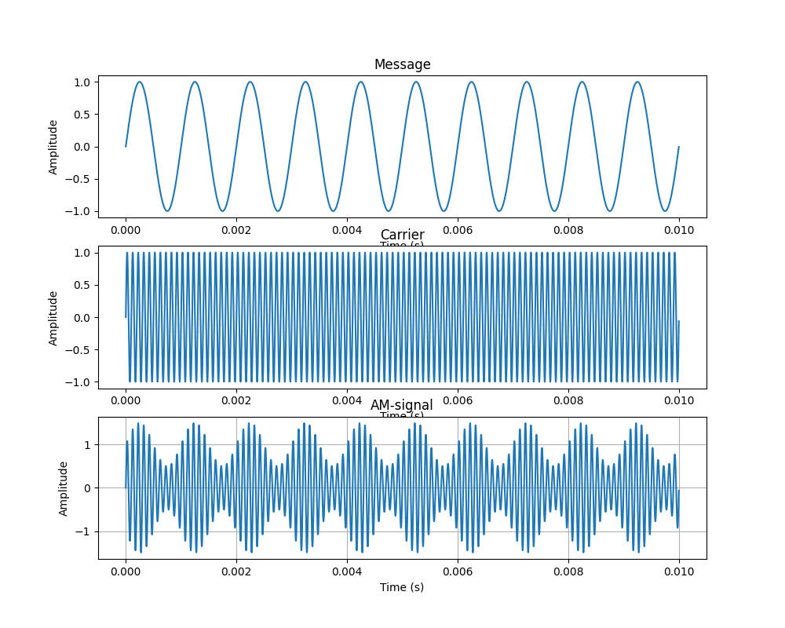
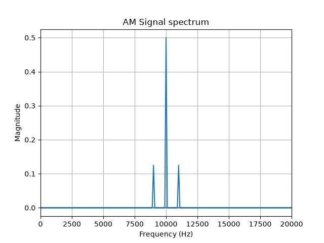
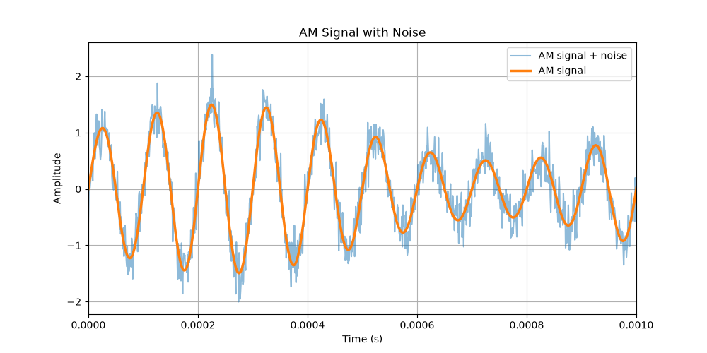
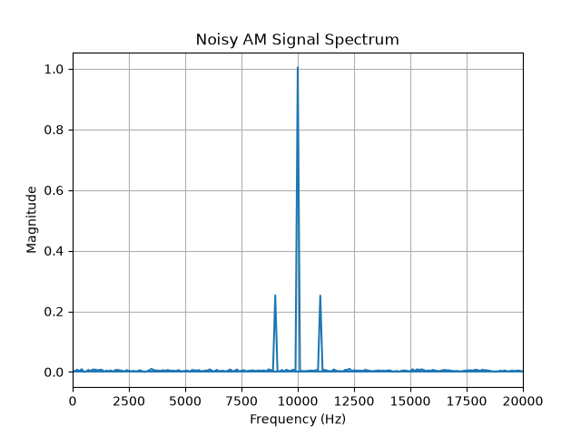

# AM Signal Processing

A small python project exploring amplitude modulation (AM) and basic signal processing techniques

# Goals

The goal of this project is to build a simple AM signal processing pipeline and explore how signals behave during modulation, noise, demodulation and filtering

The project will cover:

- Signal generation
- AM modulation
- FFT-based frequency analysis
- Noise addition
- AM demodulation
- Signal filtering
- Comparison of the original and recovered signals

## Technologies 
- Python
- NumPy
- Matplotlib
- SciPy

## Simulation Parameters

| Parameter | Symbol | Value | Unit |
| :--- | :--- | :--- | :--- |
| **Message Frequency** | $f_m$ | 1,000 | Hz |
| **Carrier Frequency** | $f_c$ | 10,000 | Hz |
| **Sampling Rate** | $f_s$ | 1,000,000 | Hz |
| **Modulation Index** | $m$ | 0.5 | — |
| **Signal-to-Noise Ratio** | SNR | 10 | dB |

## Results

### AM Modulation

Representation of the message wave, carrier wave, and modulated AM signal in the time domain.

### FFT Analysis

FFT analysis shows the carrier at 10 kHz and the upper and lower sidebands at 9 kHz and 11 kHz.

### Noise Addition

AM signal combined with Gaussian white noise at 10 dB SNR.

### Noisy Signal FFT Analysis

The frequency spectrum of the AM signal with added noise

## Project Status

- [x] Generate message signal

- [x] Generate carrier signal

- [x] Implement AM modulation

- [x] Plot signals

- [x] FFT analysis

- [x] Add noise

- [ ] AM demodulation

- [ ] Signal filtering

- [ ] Compare original and recovered signals

